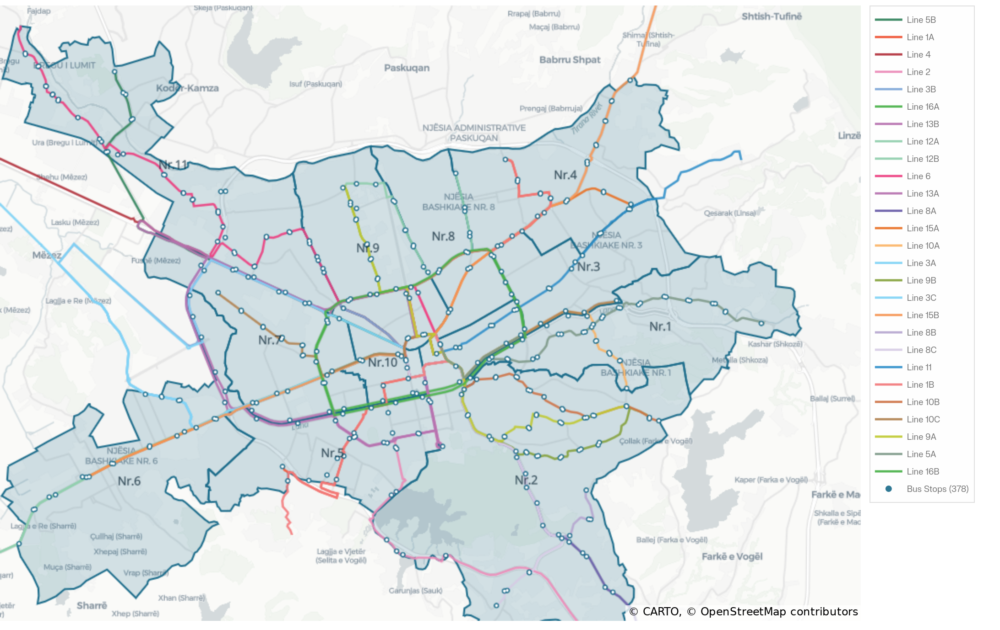

# Tirana Transit Coverage Gap & Equity Analysis

Geospatial analysis tool that identifies Tirana's 11 Municipal Units with high economic activity but poor bus transit coverage — built for city planners and transit advocates.

---

## Study Area

This project focuses exclusively on Tirana's **11 Municipal Units** (*Njësia Bashkiake Nr. 1–11*) — the urban core of the city. Outer communes (Kashar, Dajt, Farkë, Kamëz, Vaqarr) and Administrative Sub-units (Bathore, Paskuqan) are **excluded** from the analysis because:

- They have near-zero formal bus service (confirmed: 1 stop across all 4 sub-units)
- Business and population data is not available at sub-unit granularity
- The transit equity gap problem is most actionable within the urban core

---

## Coverage Map



> 11 Municipal Units · 378 bus stops · 27 routes · Study area only. Routes are shown in their official GTFS colours. Bus stops clipped to the urban core.

---

## Project Overview

The goal is to identify which of the 11 Municipal Units in Tirana have demand for transit (measured by business/POI density) that outstrips supply (bus stop coverage). The output is a ranked GeoJSON of Municipal Units with gap scores, served through a FastAPI backend and visualised in a Leaflet.js dashboard.

---

## Data Sources

| Source | What you get | Format | Status |
|---|---|---|---|
| `pt.tirana.al/gtfs/gtfs.zip` | Bus stops (490), routes (27), shapes | GTFS (CSV inside ZIP) | ✅ Active |
| OpenStreetMap (osmnx) | 11 Municipal Unit boundaries | GeoJSON | ✅ Active |
| `opendata.gov.al` business CSVs | Business counts by Albanian region | CSV | ⚠️ Disabled — too coarse for municipal-unit scope |
| OSM amenities / POI | Business/POI density at street level | GeoJSON | 🔜 Phase 2 replacement |

---

## Architecture

```
┌─────────────────────────────────────────────┐
│            Data Ingestion (Dagster)          │
│  - GTFS fetcher (stops, routes, shapes)      │
│  - OSM Overpass (Municipal Unit boundaries)  │
└────────────────┬────────────────────────────┘
                 │
┌────────────────▼────────────────────────────┐
│          Transform Layer (dbt/Python)        │
│  - Parse GTFS stops → GeoDataFrame           │
│  - Generate 400m walking isochrones          │
│  - Spatially join POI data to 11 units       │
│  - Compute coverage score per unit           │
└────────────────┬────────────────────────────┘
                 │
┌────────────────▼────────────────────────────┐
│           Analysis / Scoring                 │
│  - Coverage ratio = served area / unit area  │
│  - Gap score = POI_density - coverage_ratio  │
│  - Rank 11 Municipal Units by gap score      │
└────────────────┬────────────────────────────┘
                 │
┌────────────────▼────────────────────────────┐
│          Interactive Dashboard               │
│  - FastAPI backend (GeoJSON endpoints)       │
│  - Leaflet.js map with heatmap overlay       │
│  - Choropleth: gap score by Municipal Unit   │
│  - Bar chart: top underserved units          │
└─────────────────────────────────────────────┘
```

---

## Phased Build Plan

### Phase 1 — Data Pipeline (Week 1) ✅
1. Download and parse the GTFS feed (stops, routes, shapes)
2. Extract `stops.txt` → GeoDataFrame with lat/lon
3. Fetch the 11 Municipal Unit boundaries from OSM via `osmnx`
4. Build a Dagster pipeline with one asset per data source

### Phase 2 — Geospatial Analysis (Week 2)
1. Generate **400m walking isochrones** around each bus stop using `geopandas` buffers
2. Compute the **union of all isochrones** — the "served area" within each Municipal Unit
3. Fetch **OSM amenity/POI data** as a proxy for demand (replaces region-level business CSVs)
4. Calculate a **gap score** per Municipal Unit:
   ```
   gap = POI_density - coverage_ratio
   ```
   where `coverage_ratio = isochrone_area / unit_area`
5. Output a ranked GeoJSON of the 11 Municipal Units with scores

### Phase 3 — API + Dashboard (Week 3)
1. Wrap analysis outputs in a **FastAPI** service: `/coverage`, `/gaps`, `/stops`
2. Build a **Leaflet.js** dashboard:
   - Choropleth map coloured by gap score
   - Clickable Municipal Units showing stats
   - Bus stop markers + isochrone overlay toggle
   - Bar chart: top underserved units
3. Dockerize and deploy to Kubernetes

---

## Repository Structure

```
tirana-transit-coverage/
├── README.md
├── docker-compose.yml
├── .github/workflows/
│   └── ci.yml
├── assets/                     # Static assets & visualisations
│   └── tirana_municipal_units_map.png
├── pipeline/                   # Dagster data pipeline
│   ├── pyproject.toml
│   ├── dagster.yaml
│   └── tirana_pipeline/
│       ├── __init__.py
│       ├── assets/
│       │   ├── gtfs.py
│       │   ├── opendata.py     # disabled — granularity too coarse
│       │   └── osm.py          # scoped to 11 Municipal Units
│       └── resources.py
├── api/                        # FastAPI service (Phase 3)
│   ├── pyproject.toml
│   ├── Dockerfile
│   └── app/
│       ├── main.py
│       ├── routes/
│       └── models.py
├── dashboard/                  # Leaflet.js frontend (Phase 3)
│   ├── index.html
│   └── assets/
└── infra/                      # Kubernetes manifests
    ├── deployment.yaml
    └── configmap.yaml
```

---

## Database

DuckDB + MotherDuck is used for geospatial storage and querying.

```sql
-- Core tables
stops           (stop_id, name, geom GEOMETRY(Point, 4326))
routes          (route_id, route_name, shape GEOMETRY(LineString))
isochrones      (stop_id, radius_m, geom GEOMETRY(Polygon))
neighbourhoods  (id, name, geom GEOMETRY(MultiPolygon))  -- 11 Municipal Units only

-- Computed/scored
coverage_scores (neighbourhood_id, poi_density,
                 coverage_ratio, gap_score,
                 computed_at TIMESTAMPTZ)
```

Raw downloads (GTFS ZIP, CSVs) are kept as files in `data/raw/`. Only transformed, queryable outputs go into MotherDuck.

---

## Local Development

```bash
# Start all services
docker-compose up

# Run Dagster pipeline
cd pipeline
pip install -e .
dagster dev

# Materialise all assets
dagster asset materialize --select "*"
```

---

## Key Libraries

| Library | Purpose |
|---|---|
| `geopandas` | Vector analysis, spatial joins |
| `shapely` | Geometry operations (buffers for isochrones) |
| `osmnx` | OSM street network + Municipal Unit boundaries |
| `dagster` | Pipeline orchestration |
| `duckdb` / `motherduck` | Geospatial storage (DuckDB spatial extension) |
| `fastapi` | REST API (Phase 3) |

---

## Known Challenges

- **Isochrone accuracy**: Simple 400m buffers ignore road topology. Phase 2 will optionally upgrade to network-based isochrones via `osmnx` + `networkx`.
- **Demand proxy**: Region-level business CSVs are too coarse. Phase 2 uses OSM POI/amenity data as the demand proxy instead.
- **Coordinate systems**: All sources use WGS84 (EPSG:4326). Reproject to `EPSG:32634` (UTM zone 34N) before computing distances and areas.
